# Deploying a FortiAnalyzer VM into Proxmox

Jody Holmes  
Sr. Systems Engineer  
Fortinet  
jholmes@fortinet.com

[toc]

## Description
This tutorial describes how to deploy a [FortiAnalyzer](https://www.fortinet.com/products/management/fortianalyzer) VM into a [Proxmox](https://www.proxmox.com) hypervisor.
 
### Assumptions
1. You already have [Proxmox](https://www.proxmox.com) installed and know the basics of accessing and using the Proxmox GUI and CLI.  This tutorial uses Proxmox v8.1.5.
2. You have [Fortinet Support Portal](https://support.fortinet.com) access and can download the appropriate firmware images.
    1. We use FortiAnalyzer v7.0.14 in this tutorial.

### Workflow
---

#### Downloading FortiAnalyzer KVM image files and copying them to Proxmox

1. Login to the [Fortinet Support Portal](https://support.fortinet.com) and choose **Support > Firmware Download** from the menu at the top.

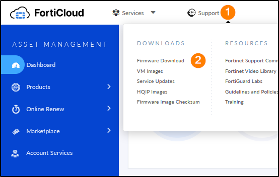

2. Ensure **FortiAnalyzer** is selected in the dropdown list **(1)**.  Click the **Download** tab **(2)** and then **v7.00** in the filelist **(3)**.

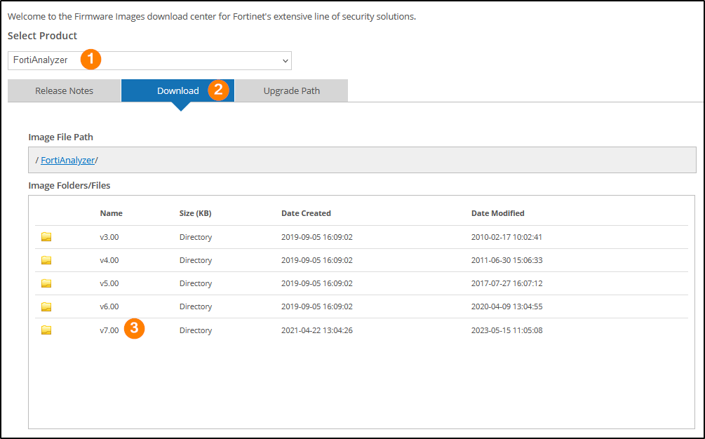

3. Click **7.0** in the filelist **(1)**.

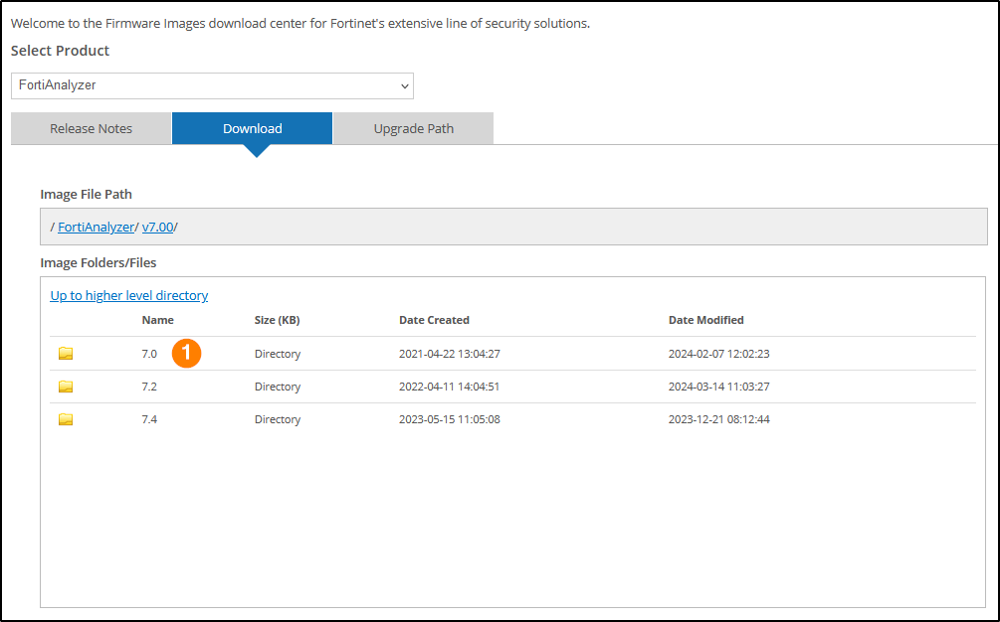

4. Finally, click **7.0.14** in the filelist **(1)**.

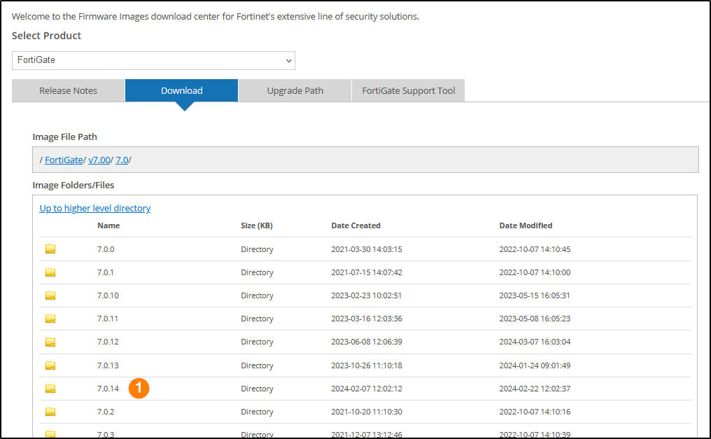

5. At this point, you should see a long list of downloadable firmwares for the various models of FortiAnalyzer hardware appliances and VM platforms.  Scroll down until you see the **FGT_VM64_KVM** builds.  You should see two entries as shown below: **FGT_VM64_KVM-v7.0.14.M-build0601-FORTINET.out** and **FGT_VM64_KVM-v7.0.14.M-build0601-FORTINET.out.kvm.zip**.  Note the differences in file extensions, i.e., **.out** versus **.kvm.zip**.

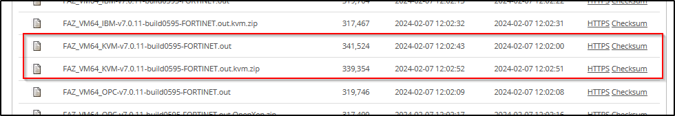

> [!TIP]
> You can use your browser's built in find feature to quickly find the files you need.  Use <kbd>Ctrl+F</kbd> or <kbd>CMD+F</kbd> and search for this string: `VM64_KVM`.

6. The **FAZ_VM64_KVM-v7.0.11-build0595-FORTINET.out** file is an actual firmware file that you would use to upgrade an already instantiated FortiAnalyzer VM to v7.0.11.  The one we need is the **FAZ_VM64_KVM-v7.0.11-build0595-FORTINET.out.kvm.zip** file.  Click the **HTTPS** link **(1)** of the ** 
FAZ_VM64_KVM-v7.0.11-build0595-FORTINET.out.kvm.zip** entry to download this file.

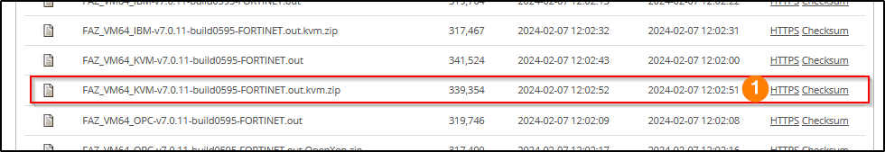

7.  Extract the contents of the **FAZ_VM64_KVM-v7.0.11-build0595-FORTINET.out.kvm.zip** to a folder.  You should see a **faz.qcow2** file.  This is the image file that we need to copy over to Proxmox.

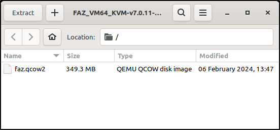

8. There are various methods to copy the **faz.qcow2** image file onto a Proxmox node.  Typically, SCP (Secure Copy) is used.  In the example below, the `scp faz.qcow2 root@pve-hp-03.skwire.net:/root/faz.qcow2`  command is used to copy the **faz.qcow2** file to the Proxmox node at `pve-hp-03.skwire.net`.  Of course, change your node address to match your Proxmox environment.  This could be a simple IP address or a FQDN as in the example.  Furthermore, this tutorial assumes you are using the root user and copying the file to the root user home directory at /root.

```sh
jholmes@jody-laptop:~/Desktop$ ls
faz.qcow2
jholmes@jody-laptop:~/Desktop$ scp faz.qcow2 root@pve-hp-03.skwire.net:/root/faz.qcow2
root@pve-hp-03.skwire.net's password: 
faz.qcow2                                     100%  333MB 110.9MB/s   00:03    
jholmes@jody-laptop:~/Desktop$ 
```

> [!NOTE]
> As mentioned above, there are various methods to get a QCOW2 image onto a Proxmox node.  In the example, commandline SCP is used.  However, you could also use a GUI SCP client like [WinSCP](https://winscp.net) on Windows or [Forklift](https://binarynights.com/) on Mac.  Finally, if you have FTP set up on your Proxmox node, you could use that as an alternative.  Use whatever method you're comfortable with.

#### Deploying the FortiAnalyzer VM into Proxmox

1. In the Proxmox GUI, highlight the node you copied the FortiAnalyzer image to **(1)** and click the **Create VM** button in the upper right **(2)**.  The **Create: Virtual Machine** dialog appears.

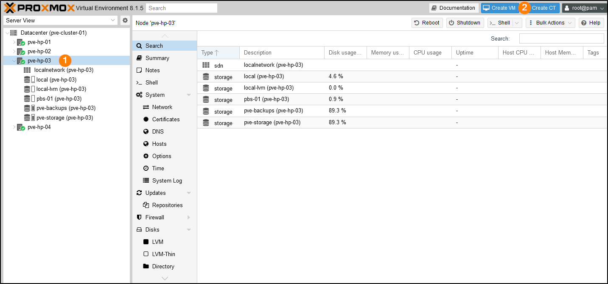

2. In the **Create: Virtual Machine** dialog's **General** tab, change the **VM ID** value, if desired **(1)**.  Make a mental note of this ID value as you will use it later.  In the **Name** field, give the virtual machine a useful name **(2)**.  Click **Next** to move to the **OS** tab **(3)**.

> [!TIP]
> You might find it useful to add the FortiAnalyzer version number to the end of your virtual machine name.  As shown below, we are using FortiAnalyzer v7.0.11 in this tutorial and `-7011` has been added to the virtual machine name.
 
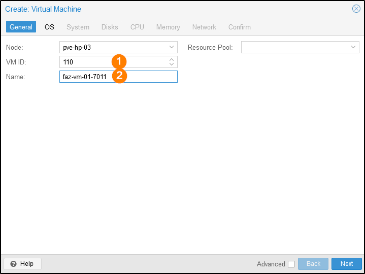

3. In the **OS** tab, select the **Do not use any media** option **(1)**.  Leave the **Type** and **Version** options at their defaults of **Linux** and **6.x - 2.6 Kernel**, respectively **(2), (3)**.  Click **Next** to move to the **System** tab **(4)**.

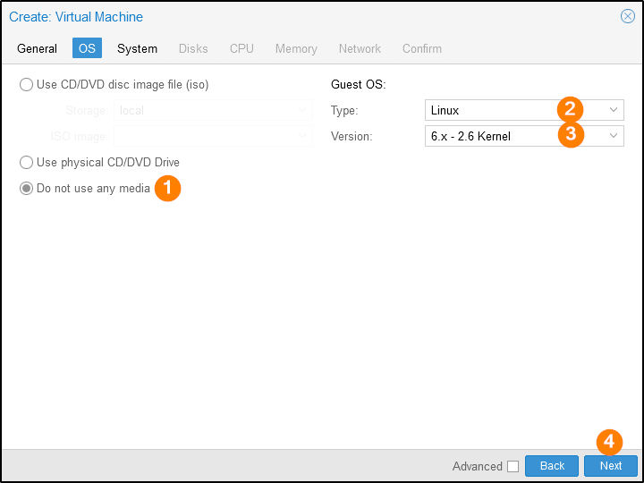

4. In the **System** tab, leave everything at their defaults and click **Next** to move to the **Disks** tab **(4)**.

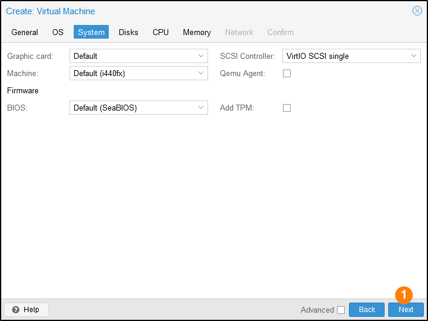

5. In the **Disks** tab, by default, you should see an entry for one SCSI disk named **scsi0**.  Click the small trashcan icon to delete this disk **(1)**.  You should now see **No Disks** displayed.  Click **Next** to move to the **CPU** tab **(2)**.

> [!NOTE]
> We add disks in a later step.

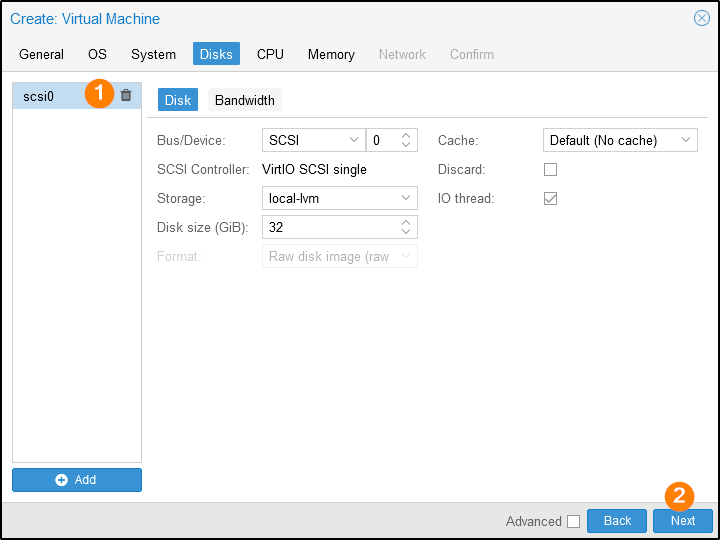

6. FortiAnalyzers are resource hungry, so change the **Cores** value to at least **2** **(1)**.  Click **Next** to move to the **Memory** tab **(2)**.

> [!TIP]
> For better performance, add more CPU sockets and/or cores.  The FortiAnalyzer VM is not limited on the number of CPU sockets or cores you can add.

> [!NOTE]
> A few years ago, Fortinet changed their free VM license from a 14-day trial period to a permanent free trial period with limiations.  See [here](https://docs.fortinet.com/document/fortianalyzer/7.0.0/vm-trial-license-guide/200800/introduction) for more information.

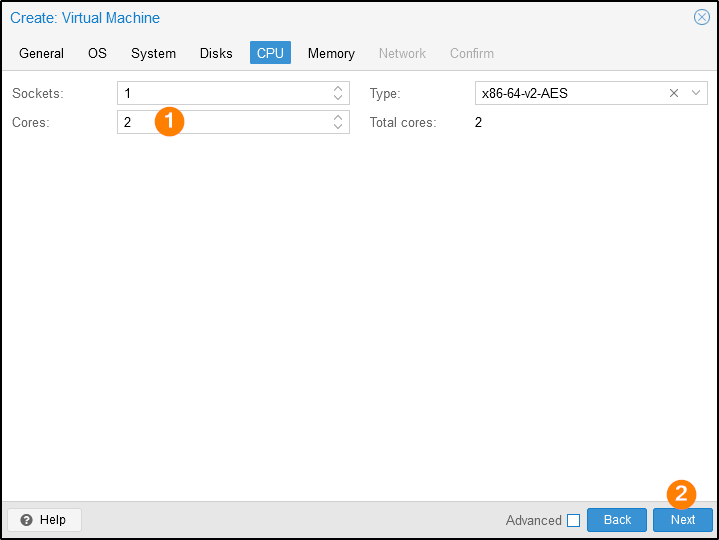

7. Increase the **Memory (MiB)** field to at least **8192**.  Click **Next** to move to the **Network** tab **(2)**.

> [!TIP]
> For better performance, add more memory.  The FortiAnalyzer VM is not limited on the amount of memory you can use.

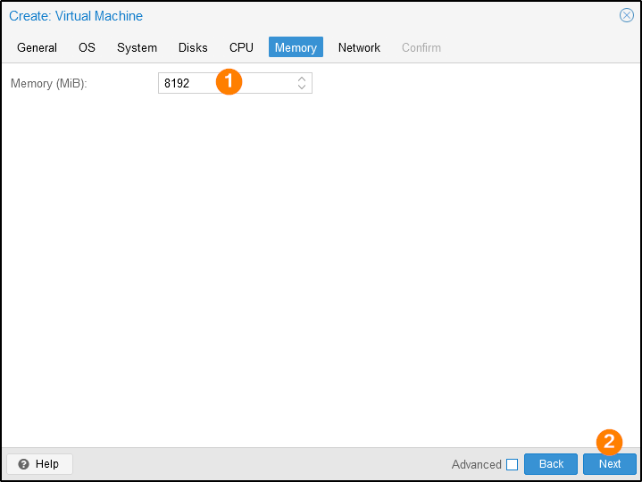

8. In the **Network** tab, *uncheck* the **Firewall** option **(1)** and leave the rest of the options at their defaults.  Click **Next** to move to the **Confirm** tab **(2)**.

> [!NOTE]
> We add more network interfaces in a later step.

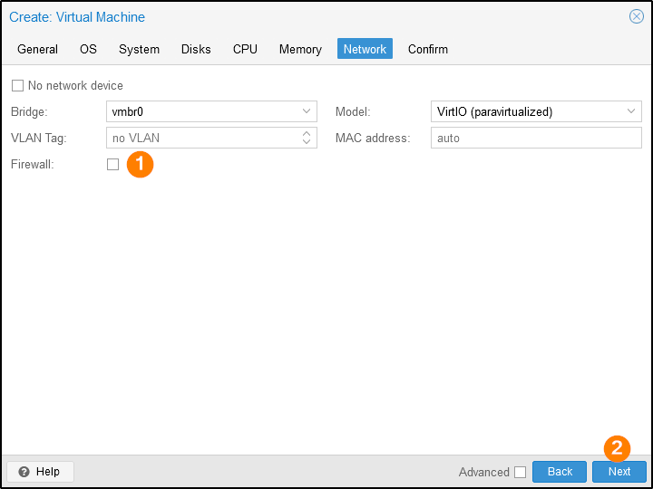

9. In the **Confirm** tab, ensure the **Start after created** option is *unchecked* **(1)**.  Again, make a mental note of the **vmid** value **(2)** as you will use it later.  Click **Finish** to build the VM **(3)**.

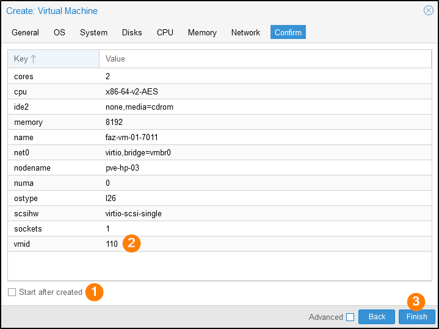

10. After some seconds, you should see the new VM in the left sidebar with the VMID and name chosen in the previous steps.

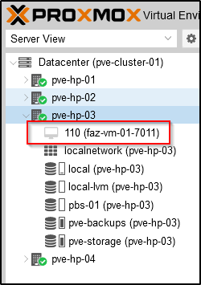

#### Importing the QCOW2 image into the FortiAnalyzer VM

1. In the Proxmox GUI, highlight the newly created VM in the left sidebar **(1)** and click **Hardware** in the middle sidebar **(2)**.  Note the presence of one network interface named **net0** **(3)** and the lack of disks **(4)**.

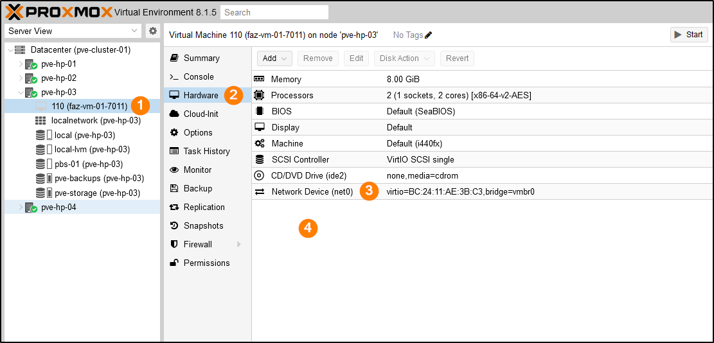

2. Highlight the Proxmox node in the left sidebar and click the **Shell** entry in the middle sidebar.  Once the shell appears, type `pwd` to ensure are in the `/root` folder and then type `ls` to display the contents of the directory.  You should see the faz.qcow2 image file we copied over earlier.

```sh
root@pve-hp-03:~# pwd
/root
root@pve-hp-03:~# ls
faz.qcow2
root@pve-hp-03:~# 
```

3. To import the faz.qcow2 image into your newly created VM, you use the `qm disk import` command:  `qm disk import <vmid> faz.qcow2 <storage device name>`.  You will need to adjust the command to match your **vmid** created earlier and **storage device name** of choice.  By default, Proxmox creates a **local** and **local-lvm** storage device when it is installed.  In the example below, we use a **vmid** of **110** and the **local-lvm** storage device.  Take note of the disk name when the command is finished.  In the example below, it's: `unused0:local-lvm:vm-110-disk-0`

```sh
root@pve-hp-03:~# qm disk import 110 faz.qcow2 local-lvm 
importing disk 'faz.qcow2' to VM 110 ...
  Rounding up size to full physical extent <4.01 GiB
  Logical volume "vm-110-disk-0" created.
transferred 0.0 B of 4.0 GiB (0.00%)
transferred 43.9 MiB of 4.0 GiB (1.07%)
transferred 85.3 MiB of 4.0 GiB (2.08%)
[...]
transferred 4.0 GiB of 4.0 GiB (99.54%)
transferred 4.0 GiB of 4.0 GiB (100.00%)
transferred 4.0 GiB of 4.0 GiB (100.00%)
Successfully imported disk as 'unused0:local-lvm:vm-110-disk-0'
root@pve-hp-03:~#
```

4. Select the FortiAnalyzer VM in the left sidebar **(1)** and click **Hardware** in the middle sidebar **(2)**.  Note the newly imported disk **(3)**.  At this point, it shows as **Unused Disk 0**.

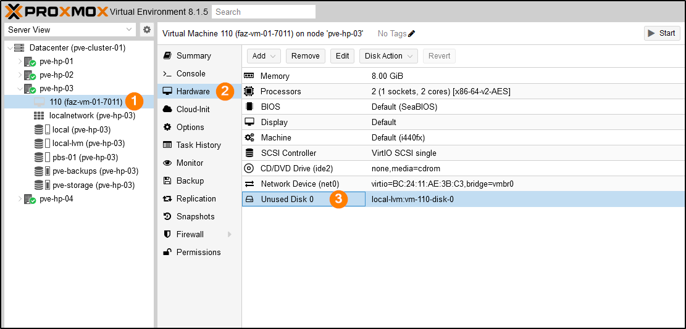

#### Adding a boot disk to the FortiAnalyzer VM

1. Highlight the **Unused Disk 0** entry **(1)** and click the **Edit** button **(2)**.

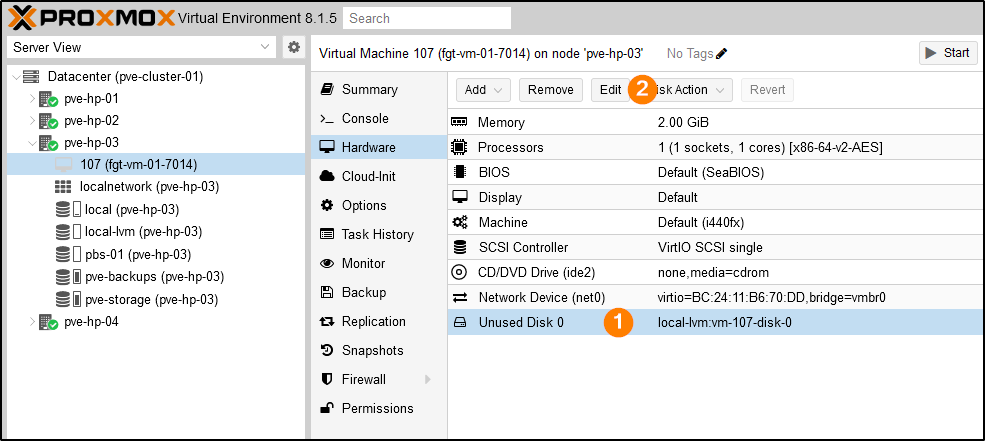

4. The **Add: Unused Disk** dialog appears.  Accept the defaults and click the **Add** button **(1)**.

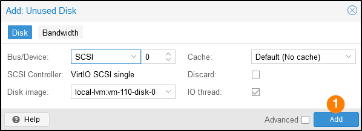

2. Note the newly added **Hard Disk (scsi0)** mapped to the **local-lvm:vm-110-disk-0** created earlier.

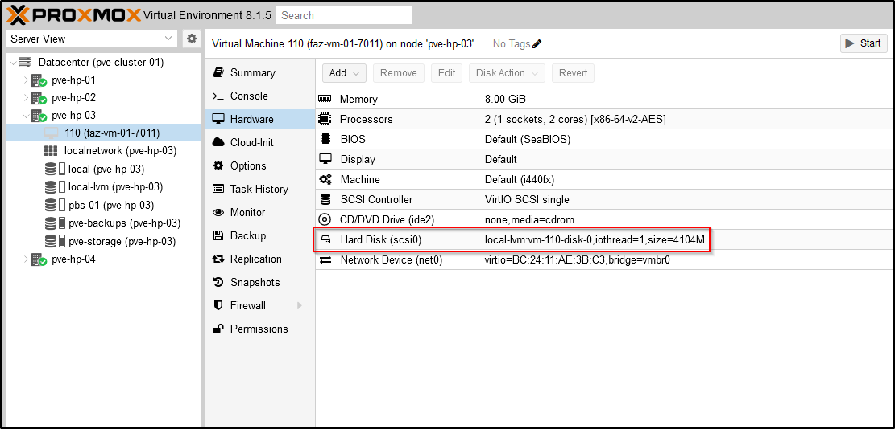

#### Adding a logging disk

FortiAnalyzer is a logging platform that, in real world applications, can require a large amount of disk space to store the ingested log files.  In this section, we add a virtual logging disk to the VM.

1. To add a logging disk, select the FortiAnalyzer VM in the left sidebar **(1)** and click **Hardware** in the middle sidebar **(2)**.  Click the **Add** button **(3)** and select **Hard Disk** from the dropdown menu **(4)**.

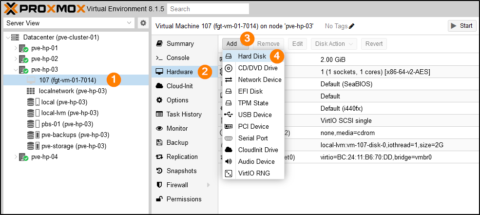

2. The **Add: Hard Disk** dialog appears.  Select **local-lvm** from the **Storage** dropdown **(1)**.  For this tutorial, we leave the **Disk size (GiB)** value at the default of **32**.  Depending on the environment or needs, this value might need to be larger.  Leave all other fields at their defaults and click **Add** to add the new disk **(2)**.

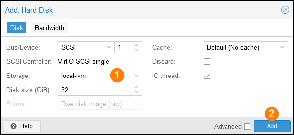

3. Note the newly added **Hard Disk (scsi1)** with a size of **32G**.  This disk will be formatted by FortiAnalyzer when you first boot the VM.

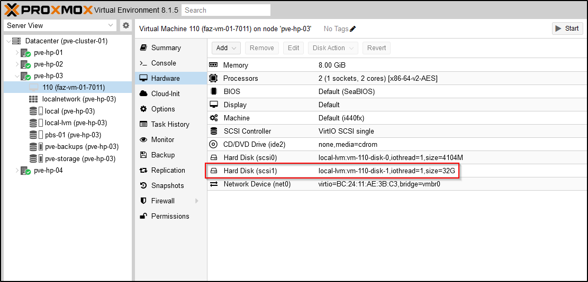

#### Optional: Adding additional network interfaces

A FortiAnalyzer VM supports up to four network interfaces.  This section demonstrates how to add additional network interfaces to the FortiAnalyzer VM.

1. To add additional network interfaces, select the FortiAnalyzer VM in the left sidebar **(1)** and click **Hardware** in the middle sidebar **(2)**.  Click the **Add** button **(3)** and select **Network Device** from the dropdown menu **(4)**.


2. The **Add: Network Device** dialog appears.  If there are additional bridges configured on your Proxmox node, you can select one from the **Bridge** dropdown **(1)**.  If not, the default **vmbr0** will suffice **(1)**.  Ensure the **Firewall** checkbox is *unchecked* **(2)**.  Click the **Add** button to add the new network interface to the VM **(3)**.  Repeat the steps to add additional network interfaces.

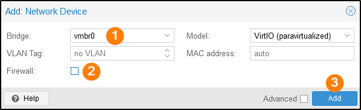

3. Note the newly added network **Network Device (net1)** interface.

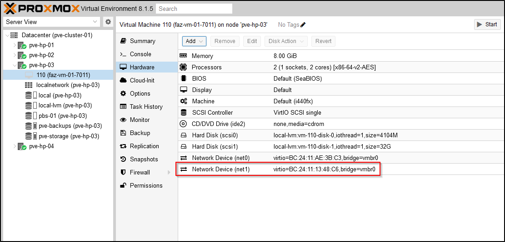

#### Verifying the Boot Order

1. To verify the boot order, select the FortiAnalyzer VM in the left sidebar **(1)** and click **Options** in the middle sidebar **(2)**.  Select the **Boot Order** entry **(3)** and click the **Edit** button **(4)**.  Alternately, you can simply double-click the **Boot Order** entry.

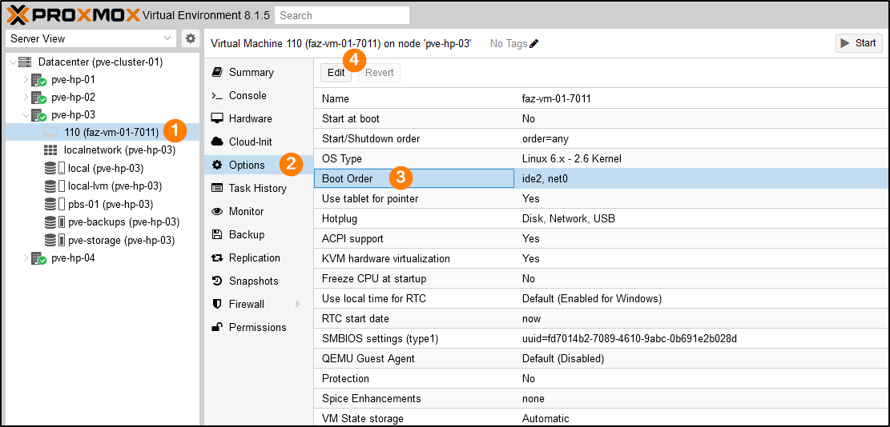

2. The **Edit: Boot Order** dialog appears.

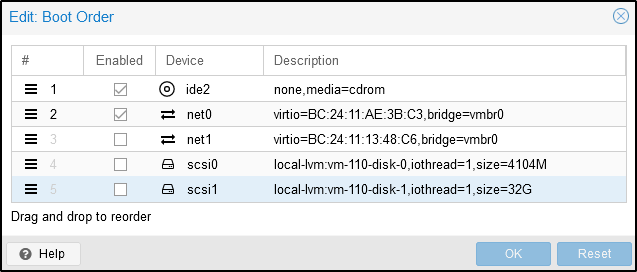

3. Use the "hamburger icons"  to drag and drop the **scsi0** disk to the top of the list and ensure the **Enabled** checkbox for that entry is *checked*.  For neatness, drag the **scsi1** entry to the second position.  Uncheck the **Enabled** boxes for the **ide2** and **net0** entries.  Click the **OK** button when finished **(1)**.  Reference the following screenshot for clarity.

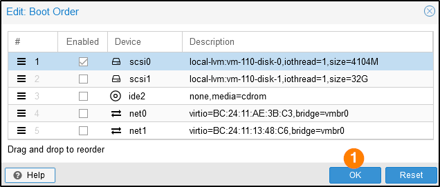

#### Booting the FortiAnalyzer VM

1. Select the FortiAnalzyer VM in the left sidebar **(1)** and select **Console** in the middle sidebar **(2)**.  Click the **Start** button **(3)** at the top or the **Start Now** button **(4)** in the midle of the console.

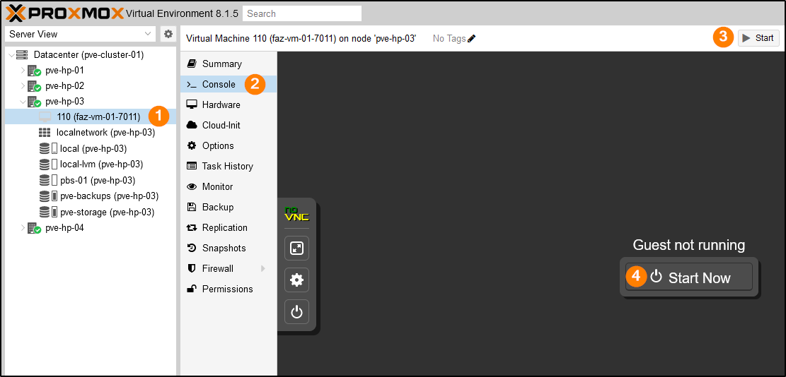

2. The FortiAnalyzer VM starts to boot, performs some intial boot items, and ends at the default FortiAnalyzer login prompt.

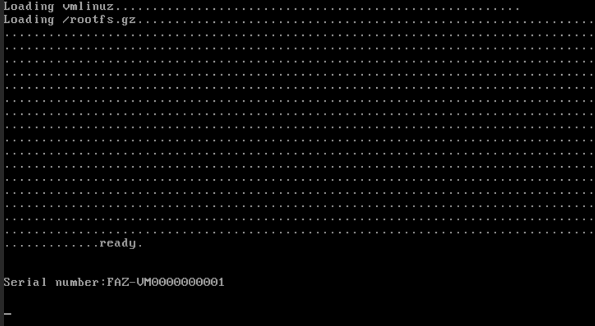
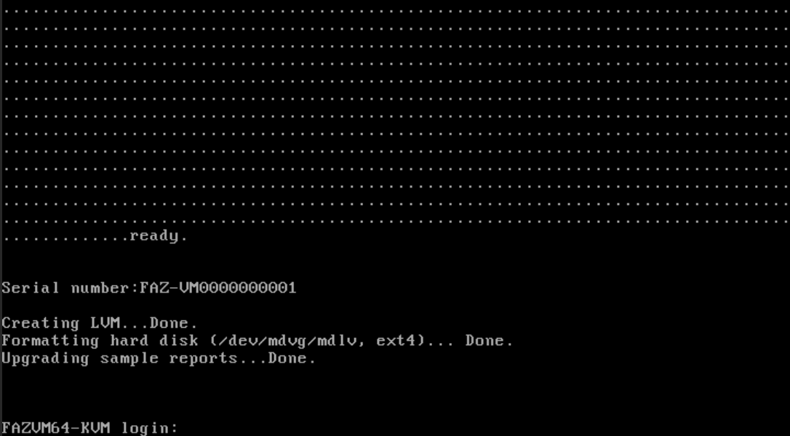

3. Login with a username of **admin** and no password.  You are prompted to enter a password, verify it, and then presented with the standard FortiAnalyzer CLI prompt.

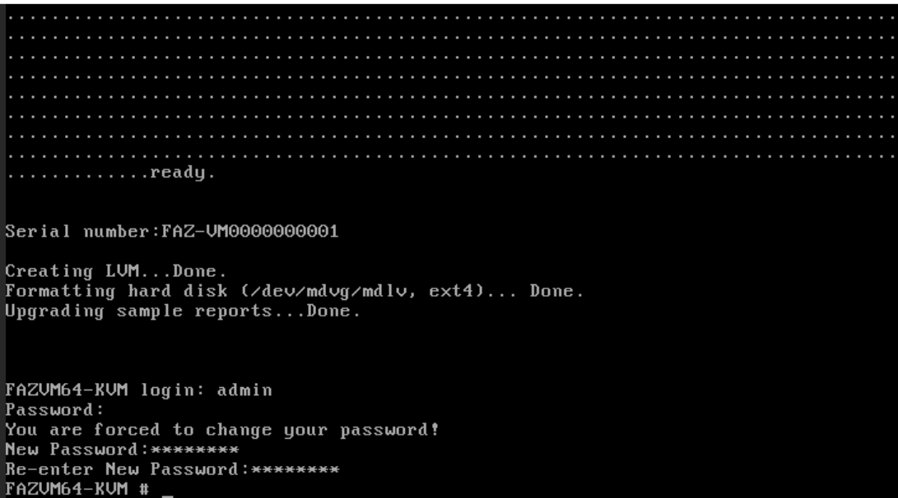

4. On a FortiAnalyzer VM, `port1` is set to the standard Fortinet management address of `192.168.1.99/24`.  Enter the `get system interface port1` command to verify this.

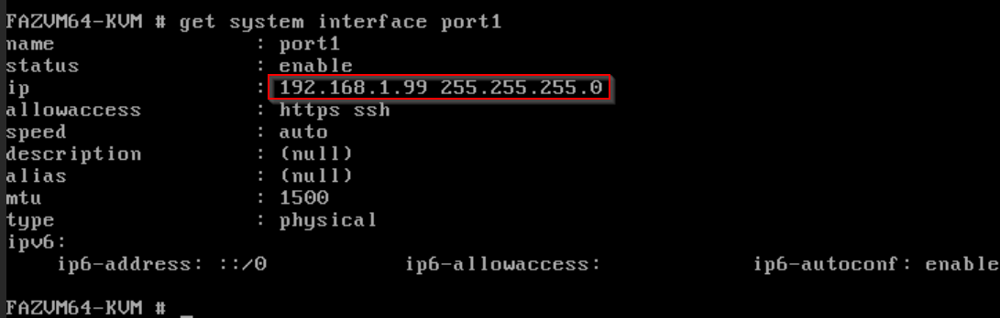

5. If your local network segment happens to be on this subnet, you can SSH or use a web browser to log into the FortiAnalyzer on `192.168.1.99`.  If not, you need to configure one of the available interfaces to match your network.  DHCP mode is not allowed on FortiAnalyzer interfaces, so manual configuration is necessary.  Here is how to change `port1` to an IP of `192.168.0.120/25` with a gateway of `192.168.0.1`.

```sh
FAZVM64-KVM # config system interface
(interface)# edit port1
(port1)# set ip 192.168.0.120 255.255.255.128
(port1)# set allowaccess https ssh ping  <--- optional to allow ping on this interface
(port1)# show
config system interface
    edit "port1"
        set ip 192.168.0.120 255.255.255.128
        set allowaccess ping https ssh
    next
end
(port1)# end
FAZVM64-KVM # config system route
(route)# edit 1
(1)# set device port1
(1)# set gateway 192.168.0.1
(1)# show
config system route
    edit 1
        set device "port1"
        set gateway 192.168.0.1
    next
end
(1)# end
FAZVM64-KVM #
```
<br>
6.  If the IP is now reachable, you can use a web browser to access the FortiAnalyzer GUI interface.

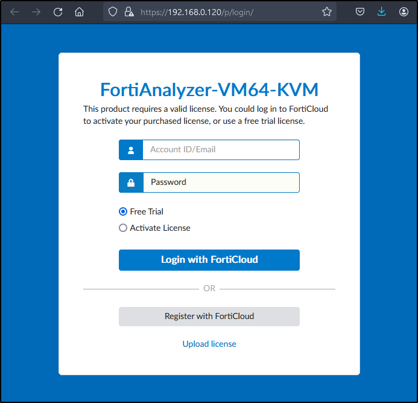

#### Useful FortiAnalyzer CLI commands

1. Use the `get system status` command to retrieve general system information.
 
```sh
FAZVM64-KVM # get system status
Platform Type                   : FAZVM64-KVM
Platform Full Name              : FortiAnalyzer-VM64-KVM
Version                         : v7.0.11-build0595 240206 (GA)
Serial Number                   : FAZ-VM0000000001
BIOS version                    : 04000002
Hostname                        : FAZVM64-KVM
Max Number of Admin Domains     : 5
Admin Domain Configuration      : Disabled
FIPS Mode                       : Disabled
HA Mode                         : Stand Alone
Branch Point                    : 0595
Release Version Information     : GA
Current Time                    : Wed Mar 27 05:54:32 PDT 2024
Daylight Time Saving            : Yes
Time Zone                       : (GMT-8:00) Pacific Time (US & Canada).
x86-64 Applications             : Yes
Disk Usage                      : Free 27.60GB, Total 31.37GB
File System                     : Ext4
License Status                  : Valid
```
<br>
2. Use the `get system performance` command to retrieve detailed performance statistics.

```sh
FAZVM64-KVM # get system performance
CPU:
        Used:                   2.89%
        Used(Excluded NICE):    2.89%
                  %used   %user   %nice  %sys    %idle %iowait  %irq %softirq
        CPU0       2.69    1.45    0.00    0.62   97.31    0.21    0.00     0.41
        CPU1       2.90    1.45    0.00    1.24   97.10    0.21    0.00     0.00
Memory:
        Total:  10,264,336 KB
        Used:   4,103,080 KB    40.0%
        Total (Excluding Swap): 8,167,188 KB
        Used (Excluding Swap):  4,103,080 KB    50.2%
Hard Disk:
        Total:  32,892,688 KB
        Used:   3,936,572 KB    12.0%
        Inode-Total:    2,097,152
        Inode-Used:     13,742  0.7%
        IOStat:   tps     r_tps    w_tps    r_kB/s    w_kB/s    queue   wait_ms  svc_ms  %util sampling_sec
                   4.4      0.1      4.3       0.5     960.2      0.0     9.0      0.1     0.0     42213.99
Flash Disk:
        Total:  1,007,512 KB
        Used:   340,752 KB      33.8%
        Inode-Total:    65,536
        Inode-Used:     41      0.1%
        IOStat:   tps     r_tps    w_tps    r_kB/s    w_kB/s    queue   wait_ms  svc_ms  %util sampling_sec
                   0.1      0.1      0.0       8.1       0.0      0.0     0.4      0.1     0.0     42213.99
```
<br>
3. Use the `diag log device` command to retrieve detailed statistics on logging devices and quotas.

```sh
FAZVM64-KVM # diag log device
Device Name          Device ID            Used Space(logs / quarantine / content / IPS) Allocated Space  Used%
Total: 0 log devices, used=0.0KB quota=unlimited

AdomName           AdomOID  Type                                   Logs                                                     Database
                                 [Retention   Quota      Used(    logs/quaranti/ content/     IPS) Used%]  [Retention   Quota      Used(  SiemDB/  hcache) Used%]
root               3        FSF    365days    15.0GB    0.0KB(   0.0KB/   0.0KB/   0.0KB/   0.0KB)  0.0%      60days    35.0GB  928.0KB(   0.0KB/   0.0KB)  0.0%
Total usage: 1 ADOMs, logs=0.0KB database=84.4MB(ADOMs usage:928.0KB(0.0KB, 0.0KB) + Internal Usage:83.5MB)

Total Quota Summary:
*** Warning: Total Allocated Quota is bigger than Total Quota! Please check the quota configuration of ADOMs!
    Total Quota      Allocated        Available        Allocate%
    25.4GB           50.0GB           0.0KB            197.1%

System Storage Summary:
    Total            Used             Available        Use%
    31.4GB           3.8GB            27.6GB           12.0%

Reserved space: 6.0GB (19.1% of total space).
```
<br>
4. Use the `execute lvm info` command to retrieve data on logging disks and sizes.

```sh
FAZVM64-KVM # exe lvm info
LVM Status: OK
LVM Size: 32GB
File System: ext4 31GB

Disk1 :         Used       32GB
Disk2 :  Unavailable        0GB
Disk3 :  Unavailable        0GB
Disk4 :  Unavailable        0GB
Disk5 :  Unavailable        0GB
Disk6 :  Unavailable        0GB
Disk7 :  Unavailable        0GB
Disk8 :  Unavailable        0GB
Disk9 :  Unavailable        0GB
Disk10:  Unavailable        0GB
Disk11:  Unavailable        0GB
Disk12:  Unavailable        0GB
Disk13:  Unavailable        0GB
Disk14:  Unavailable        0GB
Disk15:  Unavailable        0GB
```