# Deploying a FortiGate VM into Proxmox Using cloud-init and a FortiFlex Token

Jody Holmes  
Sr. Systems Engineer  
Fortinet  
jholmes@fortinet.com

[toc]

## Description
This tutorial describes how to use cloud-init, along with a FortiFlex token, to automatically provision and license a [FortiGate](https://www.fortinet.com/products/next-generation-firewall) VM on a [Proxmox](https://www.proxmox.com) hypervisor.

### Cloud-init: What is it?
[Cloud-init](https://cloud-init.io/) is the industry standard method by which cloud instances (think VMs) can be provisioned at initial boot-up.  From a FortiGate perspective, cloud-init can automatically apply 1) a supplied config, and 2) a supplied license, to a newly deployed FortiGate VM.  Fortinet's usage of cloud-init relies on the creation and use of an ISO file containing the configuration and license information.

> [!NOTE]
Fortinet's cloud-init with a FortiFlex token uses slightly different ISO contents than Fortinet's cloud-init with a full license method.

### Assumptions
1. You already have [Proxmox](https://www.proxmox.com) installed and know the basics of accessing and using the Proxmox GUI and CLI.  This tutorial uses Proxmox v8.1.4.
2. You already know how to deploy a basic [FortiGate](https://www.fortinet.com) VM into Proxmox.  If you do not know how, please refer to the [Deploying a FortiGate VM into Proxmox](https://github.com/skwire/tutorials/blob/2eef5a04d4037b555830332ca8cd404d0125e966/Deploying%20a%20FortiGate%20VM%20Into%20Proxmox/Deploying_a_FortiGate_VM_Into_Proxmox.md) tutorial.  This tutorial uses FortiOS 7.0.14, but the steps below can be applied to any verison.
3. You are familiar with Fortinet's [FortiFlex](https://www.fortinet.com/products/fortiflex) product, have created a Flex Entitlement, and have a valid, unused FortiFlex token ready to use.
4. You are at least somewhat familiar with Fortinet's usage of [cloud-init](https://cloudinit.readthedocs.io/en/latest/index.html).

### Workflow

#### Creating the config and license files
> [!NOTE]
There are various methods to create the config and license files and get them onto a Proxmox node.  You can create them locally on your computer and then SCP them to the node using command-line SCP or a GUI SCP client like [WinSCP](https://winscp.net).  You can also create them directly on the Proxmode node if you are comfortable with Linux and text editors such as nano or vi.  Use whichever method works best for you.

The config file contains standard FortiOS config lines.  For the purposes of this tutorial, we simply change the hostname.  That said, you could add as many, or as few, configuration lines as desired.  Instead of a typical FortiGate VM license file, FortiFlex uses a single token value to generate entitlement.  

In the example below, two files have been created: **config.txt** and **license.txt**.  The **config.txt** contains the lines necessary to change the hostname of the FortiGate VM.  The **license.txt** file contains a single line with the FortiFlex token value.  Of course, substitute the token value with your own valid token.

```sh
root@pve-hp-01:~# pwd
/root

root@pve-hp-01:~# ls
config.txt  license.txt

root@pve-hp-01:~# cat config.txt
config system global
set hostname my-fortigate-vm
end

root@pve-hp-01:~# cat license.txt
LICENSE-TOKEN: 4F83B7E8D79DC8FA06B3

root@pve-hp-01:~#
```

#### Creating the multipart MIME file
Use the `write-mime-multipart -o user_data config.txt license.txt` command to create a multipart MIME file from the **config.txt** and **license.txt** files.  Ensure the output file is named **user_data**.

> [!TIP]
The **write-mime-multipart** program is part of the **cloud-image-utils** package and can be installed using the `apt-get install cloud-image-utils` command in your Proxmox node.

```sh
root@pve-hp-01:~# write-mime-multipart -o user_data config.txt license.txt

root@pve-hp-01:~# cat user_data
Content-Type: multipart/mixed; boundary="===============0694302054756987148=="
MIME-Version: 1.0

--===============0694302054756987148==
Content-Type: text/plain; charset="us-ascii"
MIME-Version: 1.0
Content-Transfer-Encoding: 7bit
Content-Disposition: attachment; filename="config.txt"

config system global
set hostname my-fortigate-vm
end

--===============0694302054756987148==
Content-Type: text/plain; charset="us-ascii"
MIME-Version: 1.0
Content-Transfer-Encoding: 7bit
Content-Disposition: attachment; filename="license.txt"

LICENSE-TOKEN: 4F83B7E8D79DC8FA06B3

--===============0694302054756987148==--

root@pve-hp-01:~#
```

#### Creating the cloud-init config-drive ISO
A standard cloud-init config-drive ISO follows a specific folder structure as follows:

```sh
root@pve-hp-01:~# tree -F
./
├── config-drive/
│          └── openstack/
│              ├── content/
│              │          └── 0000 <-- License data file
│              └── latest/
│                  └── user_data <-- Configuration data file
```

When using a FortiFlex token, the format is slightly different because both the configuration data and license data are contained within the single multipart MIME file.

```sh
root@pve-hp-01:~# tree -F
./
├── config-drive/
│          └── openstack/
│              ├── content/
│              └── latest/
│                  └── user_data <-- Multipart MIME file with both configuration and license data
```

In your Proxmox node, create the directory structure above and copy your **user_data** file into the **latest** folder.

```sh
root@pve-hp-01:~# mkdir -p config-drive/openstack/content
root@pve-hp-01:~# mkdir -p config-drive/openstack/latest
root@pve-hp-01:~# cp user_data config-drive/openstack/latest/
```

Use the `mkisofs -R -r -o config-drive.iso config-drive/` command to create an ISO file.

> [!TIP]
If you do not have **mkisofs** on your Proxmox node, you can install it with the `apt-get install mkisofs` command.

```sh
root@pve-hp-01:~# ls
config-drive  config.txt  license.txt  user_data

root@pve-hp-01:~# mkisofs -R -r -o config-drive.iso config-drive
I: -input-charset not specified, using utf-8 (detected in locale settings)
Total translation table size: 0
Total rockridge attributes bytes: 890
Total directory bytes: 6144
Path table size(bytes): 56
Max brk space used 1b000
179 extents written (0 MB)

root@pve-hp-01:~# ls
config-drive  config-drive.iso  config.txt  license.txt  user_data

root@pve-hp-01:~#
```
For simplicity, we copy the `config-drive.iso` file to the `local` storage device on the Proxmox node using the `cp config-drive.iso /var/lib/vz/template/iso/` command.

```sh
root@pve-hp-01:~# cp config-drive.iso /var/lib/vz/template/iso/

root@pve-hp-01:~# ls /var/lib/vz/template/iso/
config-drive.iso

root@pve-hp-01:~#
```

> [!NOTE]
You can copy the **config-drive.iso** file to any Proxmox storage device capable of storing ISO files.

#### Deploying a FortiGate VM and attaching the config-drive.iso
1. Deploy a base FortiGate VM as described in the **[Deploying a FortiGate VM into Proxmox](https://github.com/skwire/fortinet_proxmox/blob/6e5ea478be7b720d575c271d3c9949e210d878cf/Deploying%20a%20FortiGate%20VM%20Into%20Proxmox/Deploying_a_FortiGate_VM_Into_Proxmox.md)** tutorial.  *Ensure that you do not start the VM*.

2. Select the newly created VM in Proxmox in the left sidebar **(1)** and then select the **Hardware** entry in the middle sidebar **(2)**.
    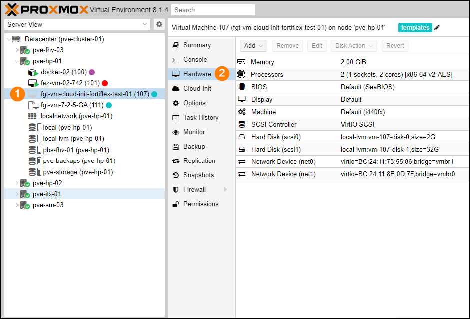

3. Click the **Add** dropdown **(1)** and choose **CD/DVD Drive** from the options **(2)**.
    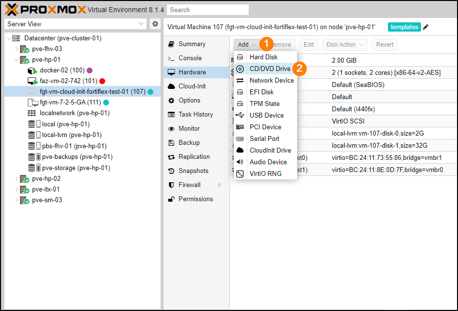

4. The **Add: CD/DVD Drive** dialog appears.  Ensure the **Use CD/DVD disc image file (iso)** option is selected **(1)**.  In the **Storage** field, choose **local (2)**.  In the **ISO image** field, choose **config-drive.iso (3)**.  Click **Add** when finished **(4)**.
    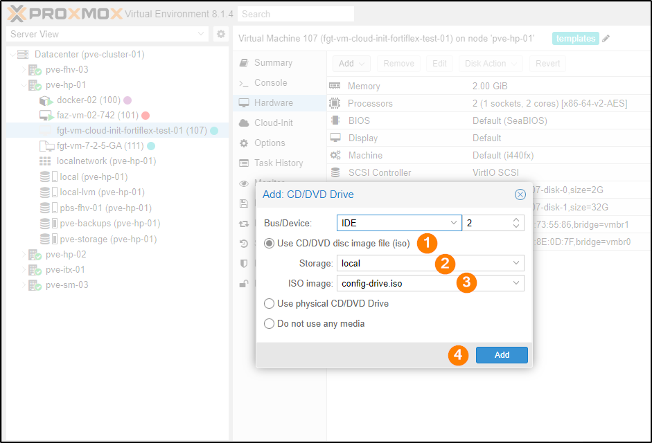

5. Ensure you see the newly added CD/DVD Drive.
    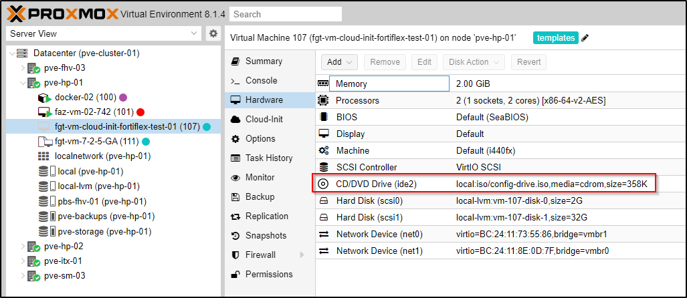

6. In the middle sidebar, choose **Options (1)**, highlight the **Boot Order** entry **(2)** and click **Edit (3)**.
    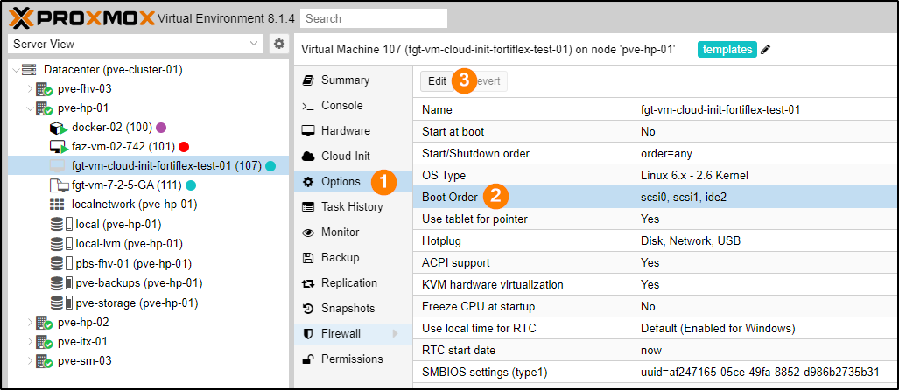
7. The **Edit: Boot Order** dialog appears.
    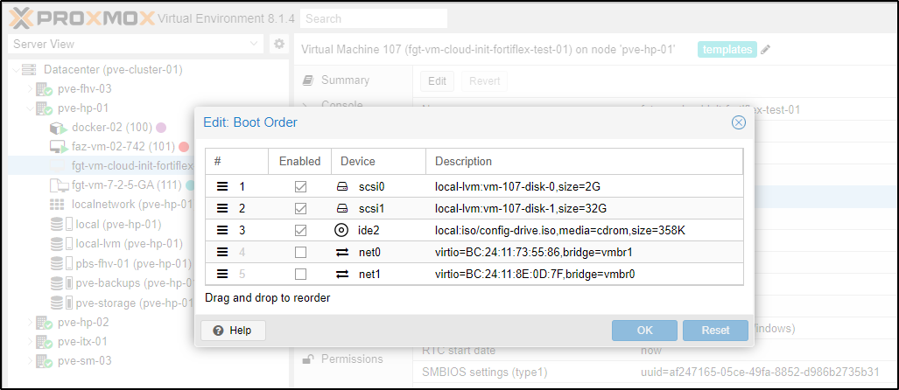

8. Using the  icons, click and drag the **ide2** entry to the top of the list and verify that it is **Enabled** with a checkmark **(1)**.  Ensure that the **scsi0** and **scsi1** entries are **Enabled** with checkmarks and any **net#** drives are *unchecked* **(2)**.  Click **OK** when done **(3)**.
    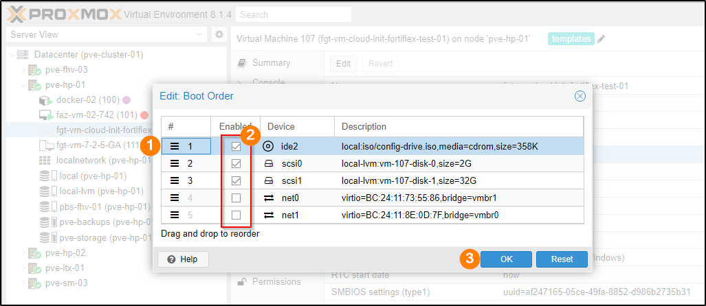

> [!IMPORTANT]
Depending on how you deployed your FortiGate VM, you might not have a **scsi1** device, and the number of **net#** interfaces you have might differ from the screenshots.

9. In the middle sidebar, choose **Console** and click the **Start Now** button.
    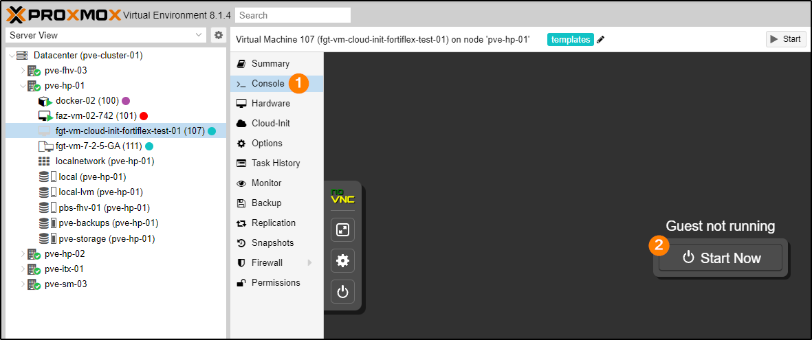

> [!NOTE]
For cloud-init to properly entitle the FortiGate, it must have internet access when it boots.  Typically, this is accomplished by the **port1** interface getting an address via DHCP.

10. The VM starts to boot **(1)**, generates a serial number **(2)**, detects and formats any extra logging drives it finds **(3)**, and reboots **(4)**.
    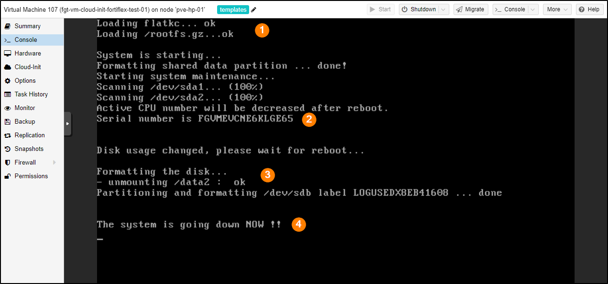

11. After the reboot, the FortiGate VM gets to this point.
    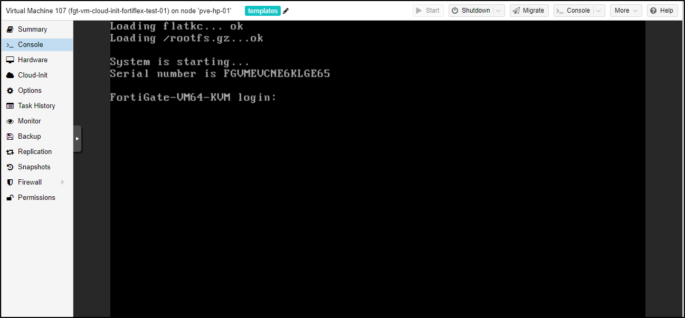

12. Allow 20-30 seconds for FortiGate to communicate with the FortiCare servers to allow proper entitlement of the VM via the FortiFlex token.  If all goes well, you should see the following FortiCare messages automatically appear, followed by another automatic reboot.
    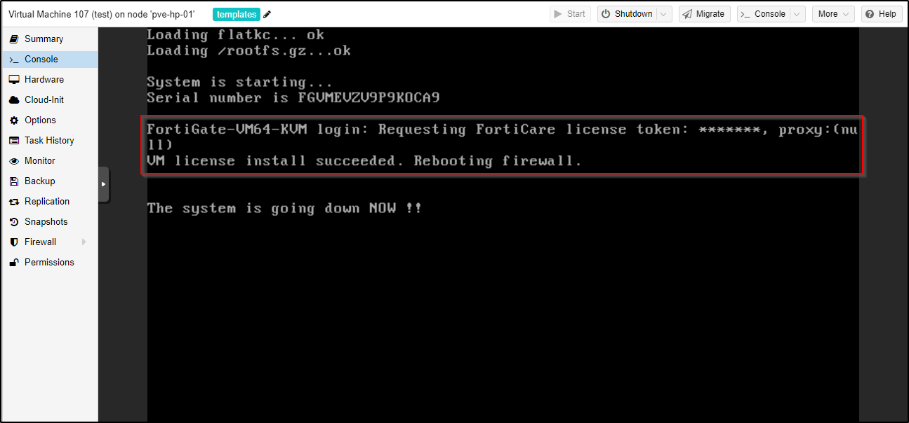

13. After the reboot, notice the prompt change to the **my-fortigate-vm** we specified in the config **(1)**.  Log in with **admin** (no password) **(2)**, change the password when requested **(3)**.
    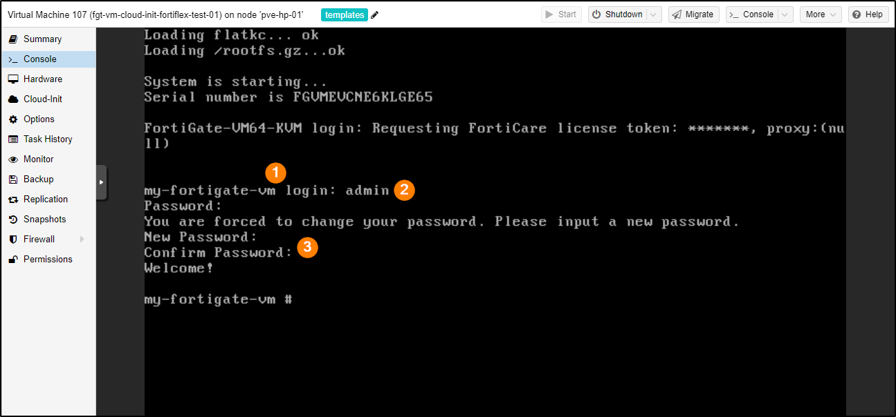

14. Issue the `get system interface physical` command (1) to see what address **port1** received from DHCP (2).
    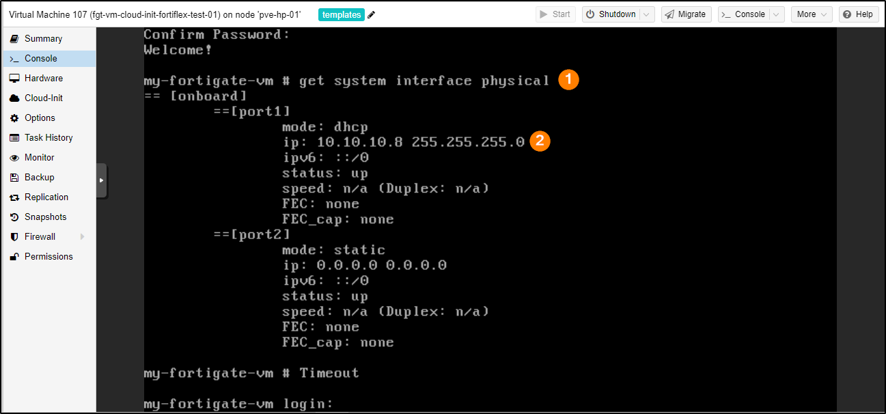

#### Verifying cloud-init operation
There are a few commands you can use to verify cloud-init worked properly.

Enter the `get system status | grep License` command to verify the license's validity and expiration date.

```sh
my-fortigate-vm # get system status | grep License
License Status: Valid
License Expiration Date: 2024-05-09
```

Enter the `diagnose debug cloud-init show` command to show the result of the cloud-init boot log.  This command is also a useful troubleshooting command when cloud-init does not work properly.

```sh
my-fortigate-vm # diagnose debug cloudinit show
 >> Checking metadata source config drive
 >> Unable to open disk /dev/ram5, No such file or directory
 >> Unable to open disk /dev/ram6, No such file or directory
 >> Unable to open disk /dev/ram7, No such file or directory
 >> Unable to open disk /dev/ram8, No such file or directory
 >> Unable to open disk /dev/ram9, No such file or directory
 >> Unable to open disk /dev/ram10, No such file or directory
 >> Unable to open disk /dev/ram11, No such file or directory
 >> Unable to open disk /dev/ram12, No such file or directory
 >> Unable to open disk /dev/ram13, No such file or directory
 >> Unable to open disk /dev/ram14, No such file or directory
 >> Unable to open disk /dev/ram15, No such file or directory
 >> Found config drive /dev/sr0
 >> Successfully mount config drive
 >> MIME parsed preconfig script
 >> MIME parsed VM token
 >> Found metadata source: config drive
 >> Run preconfig script
 >> FortiGate-VM64-KVM $  config system global
 >> FortiGate-VM64-KVM (global) $  set hostname my-fortigate-vm
 >> FortiGate-VM64-KVM (global) $  end
 >> Finish running preconfig script
 >> Trying to install vmlicense ...
 >> License-token: 4F83B7E8D79DC8FA06B3
 >> Config script not found in config drive
 >> Config script is not available
my-fortigate-vm #
```

Enter the `diagnose deb vm-print-license` command to reveal more detailed license information.

```sh
my-fortigate-vm # diagnose debug vm-print-license
SerialNumber: FGVMELTM24002814
CreateDate: Sun Mar 10 23:30:06 2024
License expires: Thu May  9 17:00:00 2024
Default Contract: FMWR:6:20240310:20240510,ENHN:20:20240310:20240510,COMP:20:20240310:20240510,AVDB:6:20240310:20240510,NIDS:6:20240310:20240510,FURL:6:20240310:20240510,SPAM:6:20240310:20240510,ISSS:6:20240310:20240510,PBDS:6:20240310:20240510,FCSS:10:20240310:20240510,FGSA:6:20240310:20240510,SWNM:6:20240310:20240510,VMLS:6:20240310:20240510:2,SOAR:6:20240310:20240510,IOTH:6:20240310:20240510,AFAC:6:20240310:20240510
Key: yes
Cert: yes
Key2: yes
Cert2: yes
Model: EL (20)
CPU: 2 (subscription:2)
MEM: 2147483647
VDOM license:
  permanent: 2
  subscription: 0
my-fortigate-vm #
```

Another useful troubleshooting command is `diagnose hardware sysinfo vm full`.

```sh
my-fortigate-vm # diagnose hardware sysinfo vm full
UUID:     a32396a9db66444c89254f991bf250f5
valid:    1
status:   1
code:     200
warn:     0
copy:     0
received: 4294941305
warning:  4294941305
recv:     202403102331
dup:
my-fortigate-vm #
```
