# Deploying a FortiGate VM into Proxmox

Jody Holmes  
Sr. Systems Engineer  
Fortinet  
jholmes@fortinet.com

[toc]

## Description
This tutorial describes how to deploy a [FortiGate](https://www.fortinet.com/products/next-generation-firewall) VM into a [Proxmox](https://www.proxmox.com) hypervisor.
 
### Assumptions
1. You already have [Proxmox](https://www.proxmox.com) installed and know the basics of accessing and using the Proxmox GUI and CLI.  This tutorial uses Proxmox v8.1.5.
2. You have [Fortinet Support Portal](https://support.fortinet.com) access and can download the appropriate firmware images.
    1. FortiOS 7.0.14 is used for this tutorial, but the steps below can be applied to any verison.

### Workflow
---

#### Downloading FortiGate KVM image files and copying them to Proxmox

1. Login to the [Fortinet Support Portal](https://support.fortinet.com) and choose **Support > Firmware Download** from the menu at the top.

    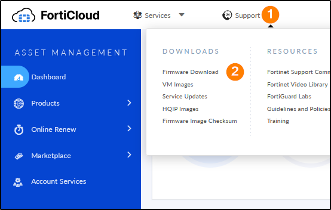

2. Ensure **FortiGate** is selected in the dropdown list **(1)**.  Click the **Download** tab **(2)** and then **v7.00** in the filelist **(3)**.

    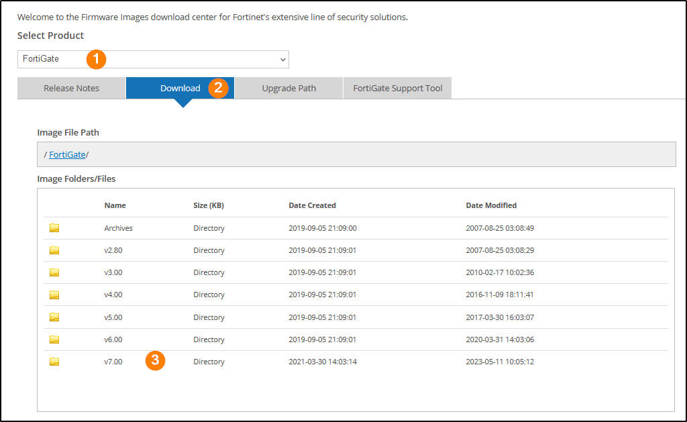

3. Click **7.0** in the filelist **(1)**.

    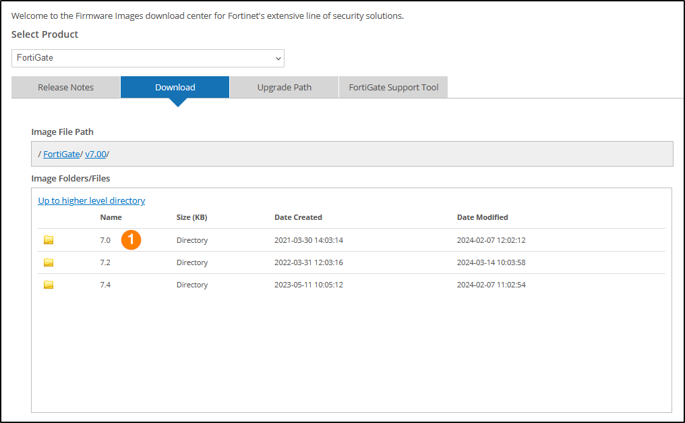

4. Finally, click **7.0.14** in the filelist **(1)**.

    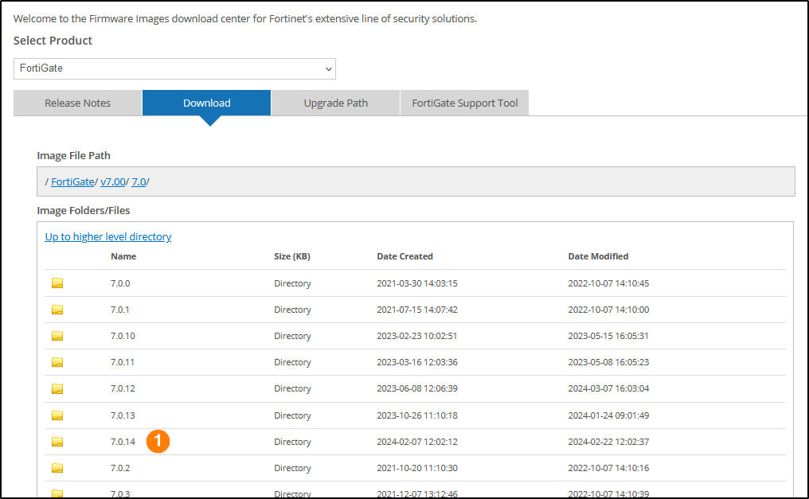

5. At this point, you should see a long list of downloadable firmwares for the various models of FortiGate hardware appliances and VM platforms.  Scroll down until you see the **FGT_VM64_KVM** builds.  You should see two entries as shown below: **FGT_VM64_KVM-v7.0.14.M-build0601-FORTINET.out** and **FGT_VM64_KVM-v7.0.14.M-build0601-FORTINET.out.kvm.zip**.  Note the differences in file extensions, i.e., **.out** versus **.kvm.zip**.

    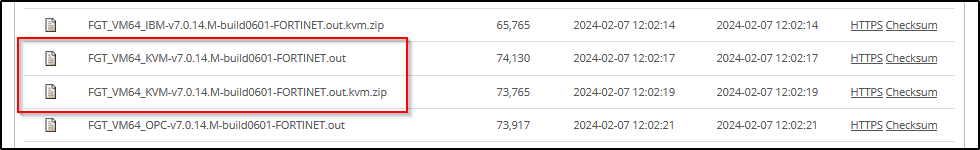

    > [!TIP]
    > You can use your browser's built in find feature to quickly find the files you need.  Use <kbd>Ctrl+F</kbd> or <kbd>CMD+F</kbd> and search for this string: `VM64_KVM`.

6. The **FGT_VM64_KVM-v7.0.14.M-build0601-FORTINET.out** file is an actual firmware file that you would use to upgrade an already instantiated FortiGate VM to v7.0.14.  The one we need is the **FGT_VM64_KVM-v7.0.14.M-build0601-FORTINET.out.kvm.zip** file.  Click the **HTTPS** link **(1)** of the **FGT_VM64_KVM-v7.0.14.M-build0601-FORTINET.out.kvm.zip** entry to download this file.

    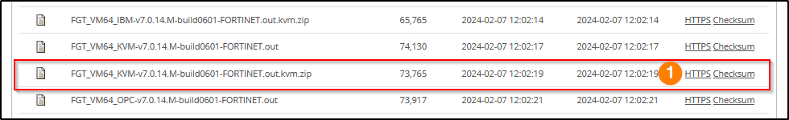

7.  Extract the contents of the **FGT_VM64_KVM-v7.0.14.M-build0601-FORTINET.out.kvm.zip** to a folder.  You should see a **fortios.qcow2** file.  This is the image file that we need to copy over to Proxmox.

    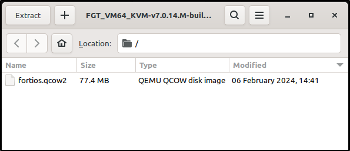

8. There are various methods to copy the **fortios.qcow2** onto a Proxmox node.  Typically, SCP (Secure Copy) is used.  In the example below, the `scp fortios.qcow2 root@pve-hp-03.skwire.net:/root/fortios.qcow2`  command is used to copy the **fortios.qcow2** file to the Proxmox node at `pve-hp-03.skwire.net`.  Of course, change your node address to match your Proxmox environment.  This could be a simple IP address or a FQDN as in the example.  Furthermore, this tutorial assumes you are using the root user and copying the file to the root user home directory at /root.

    ```sh
    jholmes@jholmes-laptop:~/Desktop$ ls
    fortios.qcow2
    jholmes@jholmes-laptop:~/Desktop$ scp fortios.qcow2 root@pve-hp-03.skwire.net:/root/fortios.qcow2
    root@pve-hp-03.skwire.net's password: 
    fortios.qcow2                                                                100%   74MB 109.8MB/s   00:00    
    jholmes@jholmes-laptop:~/Desktop$ 
    ```

    > [!NOTE]
    > As mentioned above, there are various methods to get a QCOW2 image onto a Proxmox node.  In the example, commandline SCP is used.  However, you could also use a GUI SCP client like [WinSCP](https://winscp.net) on Windows or [Forklift](https://binarynights.com/) on Mac.  Finally, if you have FTP set up on your Proxmox node, you could use that as an alternative.  Use whatever method you're comfortable with.

#### Deploying the FortiGate VM into Proxmox

1. In the Proxmox GUI, highlight the node you copied the FortiOS image to **(1)** and click the **Create VM** button in the upper right **(2)**.  The **Create: Virtual Machine** dialog appears.

    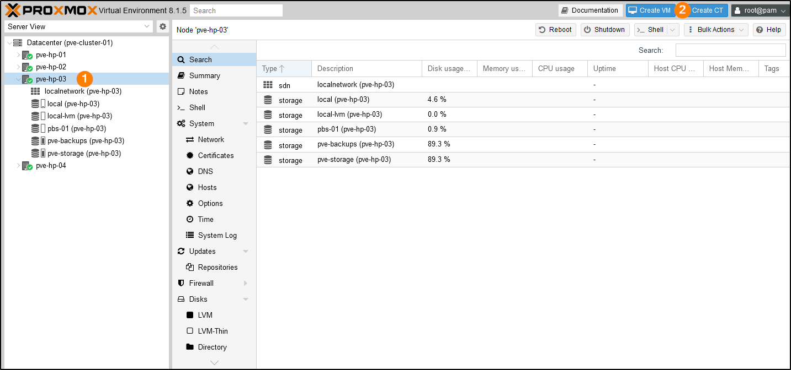

2. In the **Create: Virtual Machine** dialog's **General** tab, change the **VM ID** value, if desired **(1)**.  Make a mental note of this ID value as you will use it later.  In the **Name** field, give the virtual machine a useful name **(2)**.  Click **Next** to move to the **OS** tab **(3)**.

    > [!TIP]
    > You might find it useful to add the FortiOS version number to the end of your virtual machine name.  As shown below, we are using FortiOS v7.0.14 in this tutorial and `-7014` has been added to the virtual machine name.

    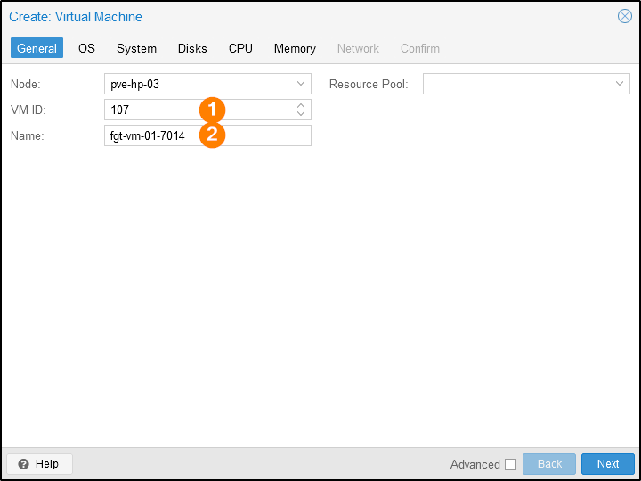

3. In the **OS** tab, select the **Do not use any media** option **(1)**.  Leave the **Type** and **Version** options at their defaults of **Linux** and **6.x - 2.6 Kernel**, respectively **(2), (3)**.  Click **Next** to move to the **System** tab **(4)**.

    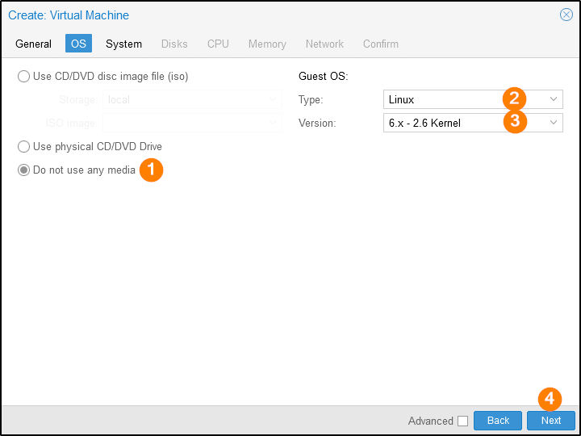

4. In the **System** tab, leave everything at their defaults and click **Next** to move to the **Disks** tab **(1)**.

    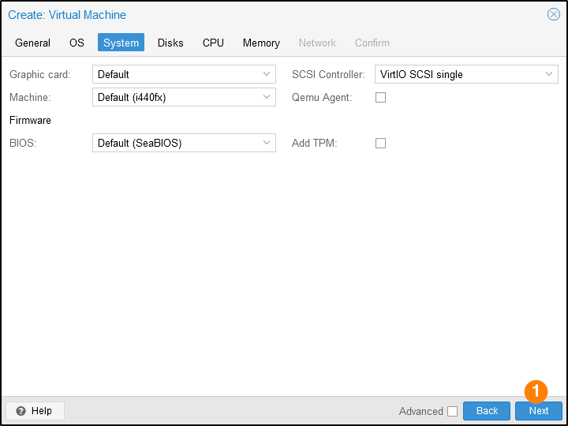

5. In the **Disks** tab, by default, you should see an entry for one SCSI disk named **scsi0**.  Click the small trashcan icon to delete this disk **(1)**.  You should now see **No Disks** displayed.  Click **Next** to move to the **CPU** tab **(2)**.

    > [!NOTE]
    > We add disks in a later step.

    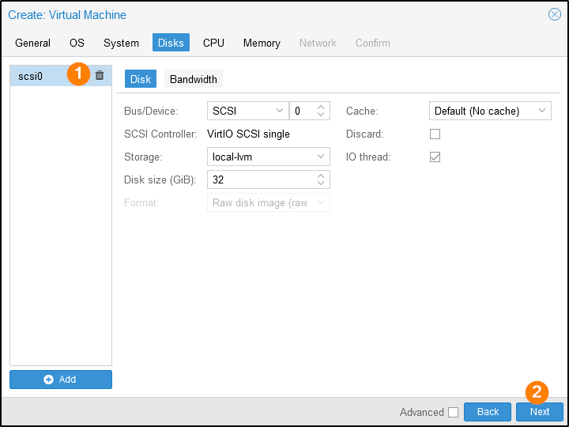

6. For the purposes of this tutorial, we leave the **CPU** tab values at their defaults.  If you have a valid FortiGate VM license (VM02, VM04, VM08, etc), feel free to increase the values to match your license.  Click **Next** to move to the **Memory** tab **(1)**.

    > [!NOTE]
    > A few years ago, Fortinet changed their free VM license from a 14-day trial period to a permanent free trial period with limitations.  See [here](https://docs.fortinet.com/document/fortigate/7.4.3/administration-guide/441460/permanent-trial-mode-for-fortigate-vm) for more information.

    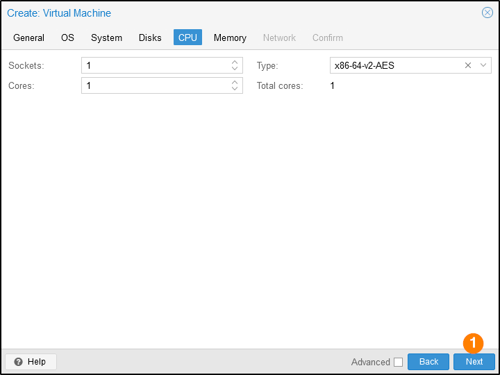

7. For the purposes of this tutorial, we leave the **Memory** tab values at their defaults.  If you have a valid FortiGate VM license (VM02, VM04, VM08, etc), there is no memory limit, so feel free to increase the memory value as desired.  Click **Next** to move to the **Network** tab **(1)**.

    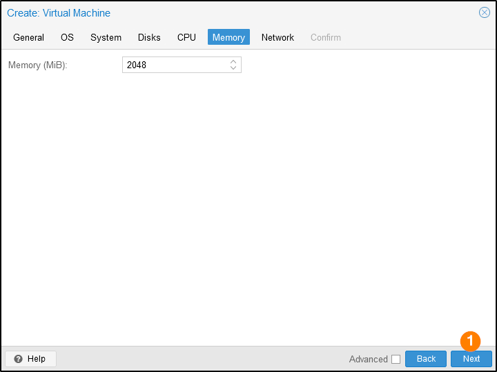

8. In the **Network** tab, *uncheck* the **Firewall** option **(1)** and leave the rest of the options at their defaults.  Click **Next** to move to the **Confirm** tab **(2)**.

    > [!NOTE]
    > We add more network interfaces in a later step.

    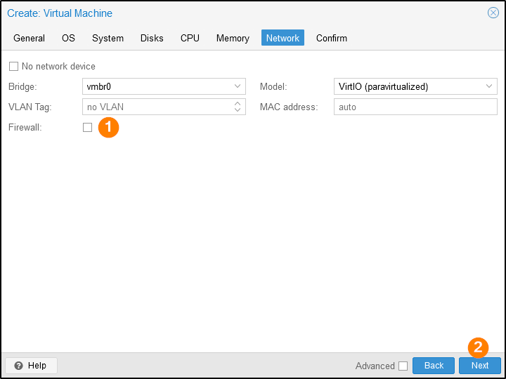

9. In the **Confirm** tab, ensure the **Start after created** option is *unchecked* **(1)**.  Again, make a mental note of the **vmid** value **(2)** as you will use it later.  Click **Finish** to build the VM **(3)**.

    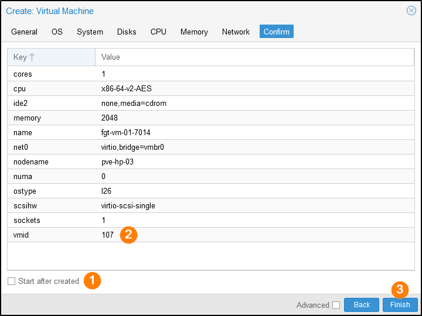

10. After some seconds, you should see the new VM in the left sidebar with the VMID and name chosen in the previous steps.

    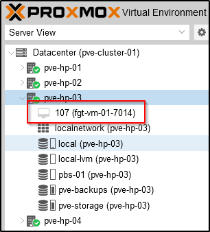

#### Importing the QCOW2 image into the FortiGate VM

1. In the Proxmox GUI, highlight the newly created VM in the left sidebar **(1)** and click **Hardware** in the middle sidebar **(2)**.  Note the presence of one network interface named **net0** **(3)** and the lack of disks **(4)**.

    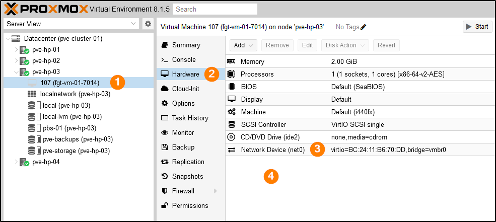

2. Highlight the Proxmox node in the left sidebar and click the **Shell** entry in the middle sidebar.  After the shell appears, type `pwd` to ensure are in the `/root` folder and then type `ls` to display the contents of the directory.  You should see the fortios.qcow2 image file we copied over earlier.

    ```sh
    root@pve-hp-03:~# pwd
    /root
    root@pve-hp-03:~# ls
    fortios.qcow2
    root@pve-hp-03:~# 
    ```

3. To import the fortios.qcow2 image into your newly created VM, you use the `qm disk import` command:  `qm disk import <vmid> fortios.qcow2 <storage device name>`.  You will need to adjust the command to match your **vmid** created earlier and **storage device name** of choice.  By default, Proxmox creates a **local** and **local-lvm** storage device when it is installed.  In the example below, we use a **vmid** of **107** and the **local-lvm** storage device.  Take note of the disk name when the command is finished.  In the example below, it's: `unused0:local-lvm:vm-107-disk-0`

    ```sh
    root@pve-hp-03:~# qm disk import 107 fortios.qcow2 local-lvm
    importing disk 'fortios.qcow2' to VM 107 ...
      Logical volume "vm-107-disk-0" created.
    transferred 0.0 B of 2.0 GiB (0.00%)
    transferred 24.4 MiB of 2.0 GiB (1.19%)
    transferred 50.6 MiB of 2.0 GiB (2.47%)
    [...]
    transferred 2.0 GiB of 2.0 GiB (98.21%)
    transferred 2.0 GiB of 2.0 GiB (99.91%)
    transferred 2.0 GiB of 2.0 GiB (100.00%)
    Successfully imported disk as 'unused0:local-lvm:vm-107-disk-0'
    root@pve-hp-03:~# 
    ```

4. Select the FortiGate VM in the left sidebar **(1)** and click **Hardware** in the middle sidebar **(2)**.  Note the newly imported disk **(3)**.  At this point, it shows as **Unused Disk 0**.

    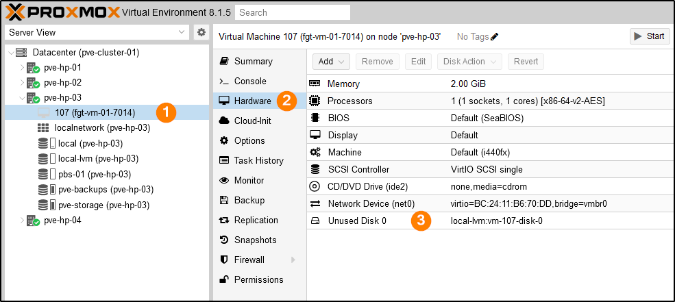

#### Adding a boot disk to the FortiGate VM

1. Highlight the **Unused Disk 0** entry **(1)** and click the **Edit** button **(2)**.

    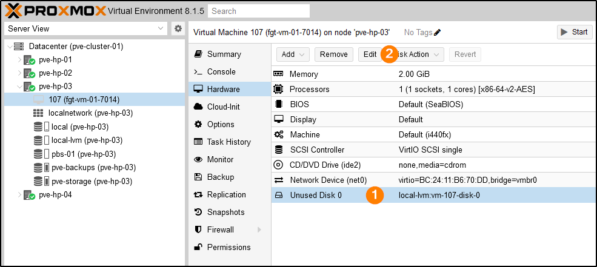

4. The **Add: Unused Disk** dialog appears.  Accept the defaults and click the **Add** button **(1)**.

    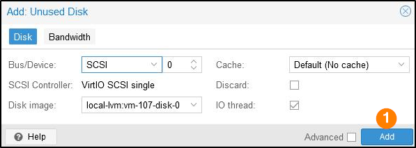

2. Note the newly added **Hard Disk (scsi0)** is now mapped to the **local-lvm:vm-107-disk-0** created earlier.

    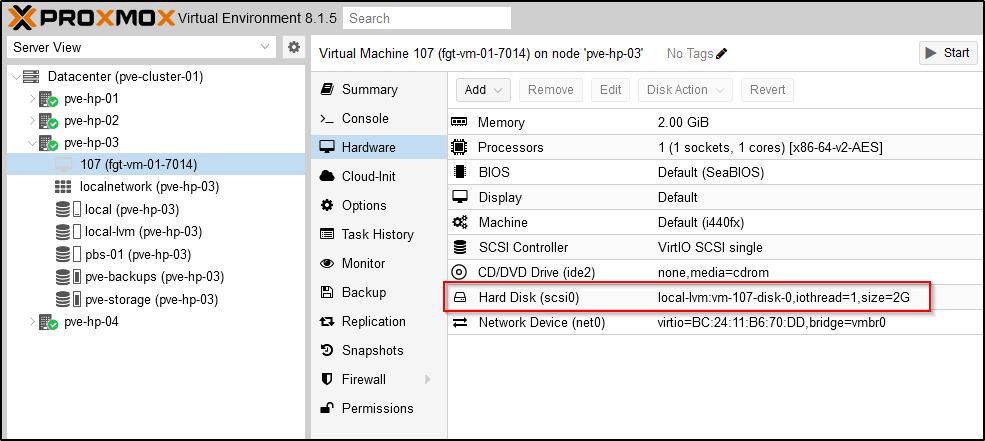

#### Optional: Adding a logging disk

FortiGate hardware model numbers that end in a "1" have an extra storage device on-board for logging or the WAN optimization feature, i.e, FG-6==1==F, FG-10==1==F, FG-180==1==F, etc.  You can duplicate that functionality on a FortiGate VM by adding a virtual logging disk.

1. To add a logging disk, select the FortiGate VM in the left sidebar **(1)** and click **Hardware** in the middle sidebar **(2)**.  Click the **Add** button **(3)** and select **Hard Disk** from the dropdown menu **(4)**.

    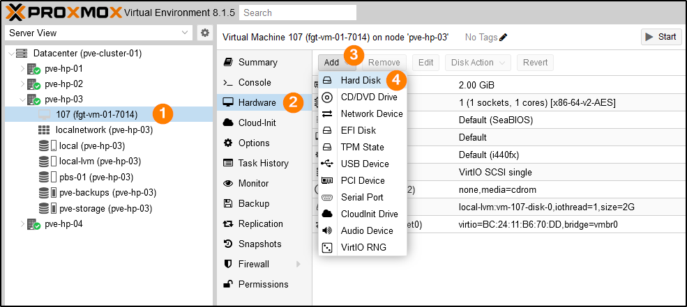

2. The **Add: Hard Disk** dialog appears.  Select **local-lvm** from the **Storage** dropdown **(1)**. You can leave the **Disk size (GiB)** value at **32** or change it as desired.  Leave all other fields at their defaults and click **Add** to add the new disk **(2)**.

    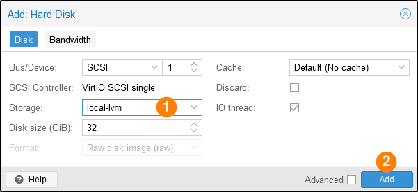

3. Note the newly added **Hard Disk (scsi1)** with a size of **32G**.  This disk will be formatted by FortiOS when you first boot the VM.

    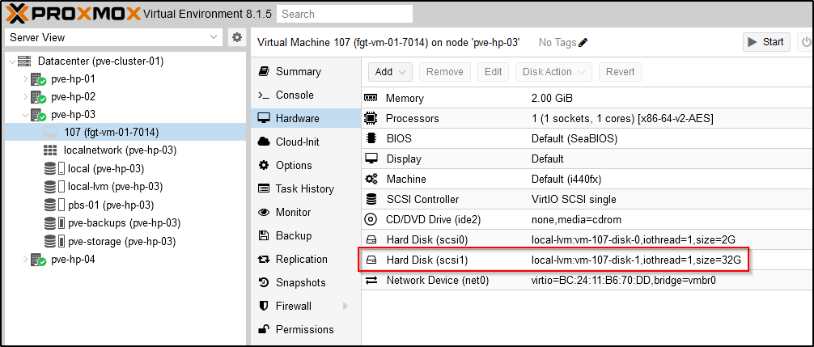

#### Optional: Adding additional network interfaces

With the free, unlicensed, FortiGate VM, a maximum of three network interfaces are supported.  With a fully licensed FortiGate VM, a maximum of twelve interfaces are supported.

1. To add additional network interfaces, select the FortiGate VM in the left sidebar **(1)** and click **Hardware** in the middle sidebar **(2)**.  Click the **Add** button **(3)** and select **Network Device** from the dropdown menu **(4)**.

    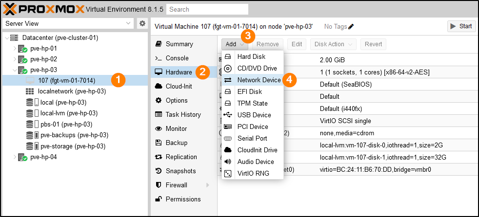

2. The **Add: Network Device** dialog appears.  If there are additional bridges configured on your Proxmox node, you can select it from the **Bridge** dropdown **(1)**.  If not, the default **vmbr0** will suffice.  Ensure the **Firewall** checkbox is *unchecked*.  Click the **Add** button to add the new network interface to the VM.  Repeat the steps to add a third network interface to the VM.

    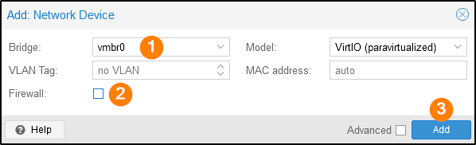

3. Note the newly added network **Network Device (net1)** and **Network Device (net2)** interfaces.

    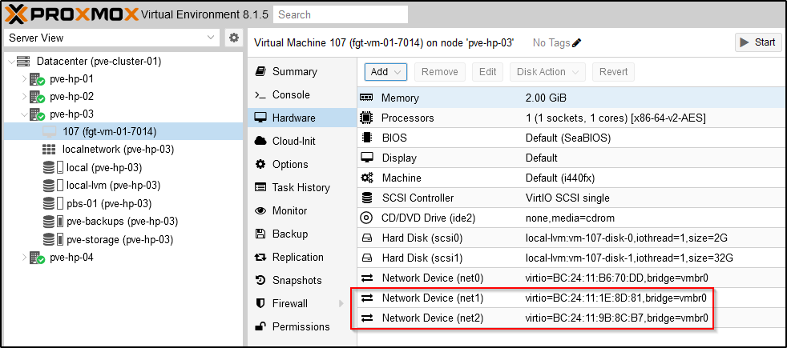

#### Verifying the Boot Order

1. To verify the boot order, select the FortiGate VM in the left sidebar **(1)** and click **Options** in the middle sidebar **(2)**.  Select the **Boot Order** entry **(3)** and click the **Edit** button **(4)**.  Alternately, you can simply double-click the **Boot Order** entry.

    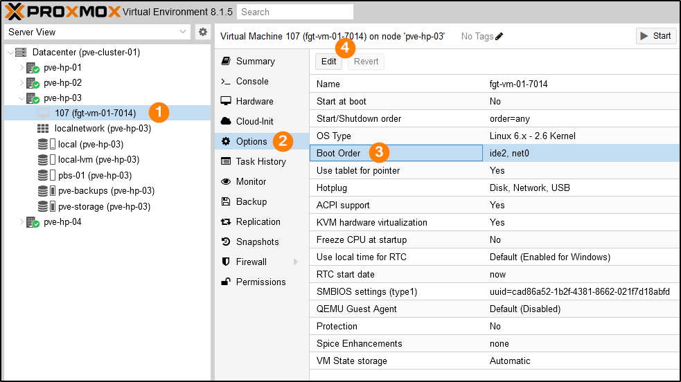

2. The **Edit: Boot Order** dialog appears.

    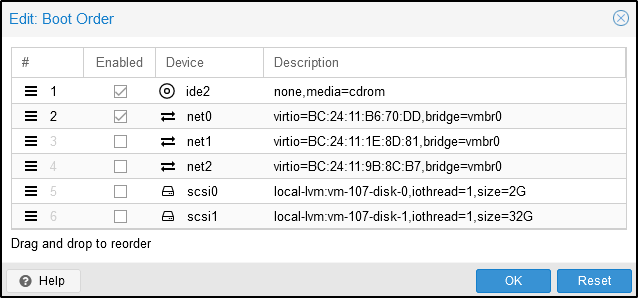

3. Use the "hamburger icons"  to drag and drop the **scsi0** disk to the top of the list and ensure the **Enabled** checkbox for that entry is *checked*.  For neatness, drag the **scsi1** entry to the second position.  Uncheck the **Enabled** boxes for the **ide2** and **net0** entries.  Click the **OK** button when finished **(1)**.  Reference the following screenshot for clarity.

    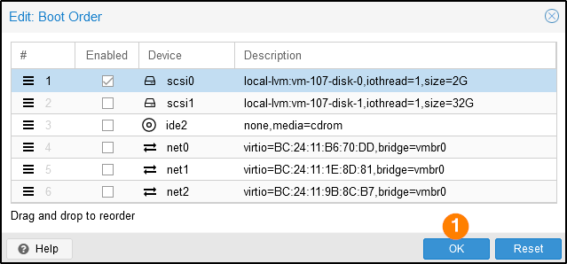

#### Booting the FortiGate VM

1. Select the FortiGate VM in the left sidebar **(1)** and select **>_ Console** in the middle sidebar **(2)**.  Click the **Start** button **(3)** at the top or the **Start Now** button **(4)** in the midle of the console.

    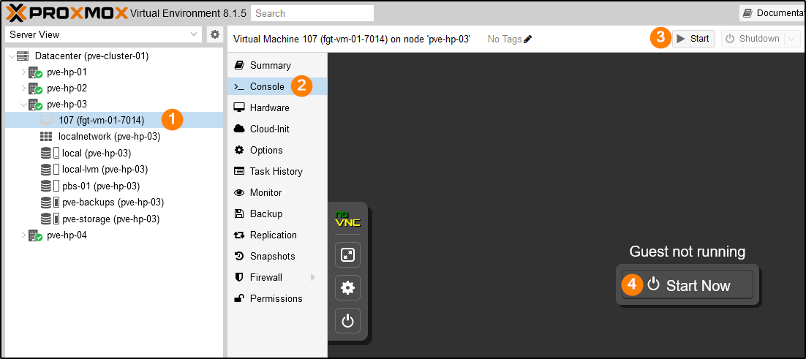

2. The FortiGate VM starts to boot, detects the logging disk, formats it, and reboots.

    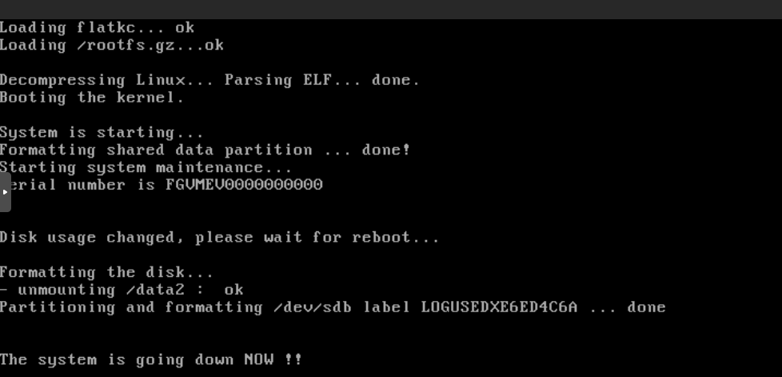

3. After the reboot, the standard FortiGate login prompt is displayed.  Login with a username of **admin** and no password.  You are prompted to enter a password, verify it, and then presented with the standard FortiOS CLI prompt.

    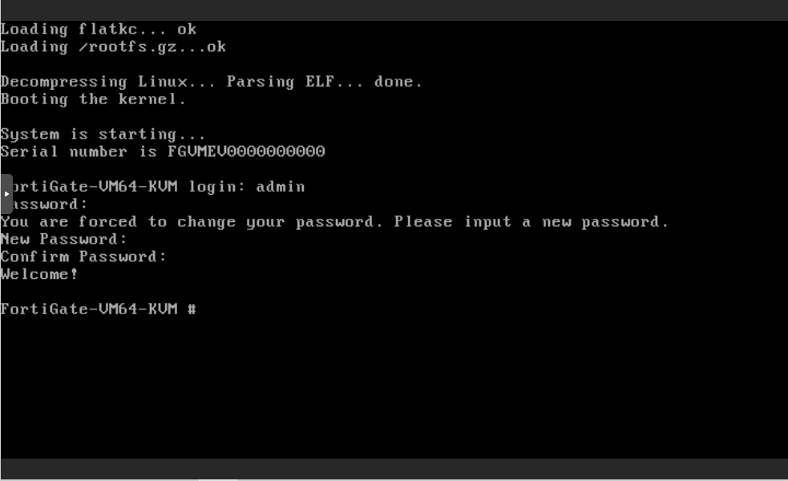

4. On a FortiGate VM, `port1` is set to `dhcp` mode **(1)**.  Assuming DHCP is running on the **vmbr0** bridge segment, enter the `get system interface physical` command to see which IP was received on the `port1` interface of the FortiGate.  In the screenshot below, you can see this FortiGate VM received an IP of `192.168.0.19` on the `port1` interface **(2)**.  The two additional interfaces you added previously map to `port2` and `port3` on the FortiGate VM **(3) (4)**.  Note that additional interfaces, by default, are set to `static` mode **(5) (6)**.

    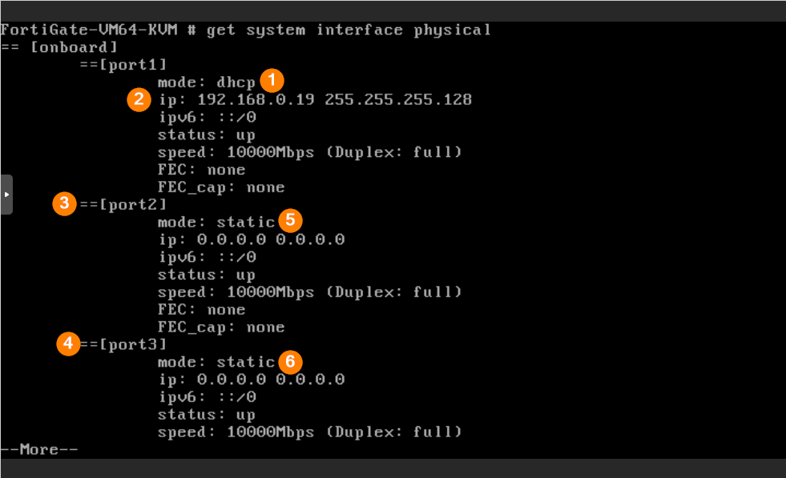

5. Enter the `show system interface port1` to verify which services are available on this interface.  By default, `ping`, `https`, `ssh`, `http`, and `fgfm` are allowed.  Ping, HTTP, HTTPS, and SSH are probably familiar to you.  FGFM is the protocol that FortiManagers and FortiGates use to communicate with each other.

    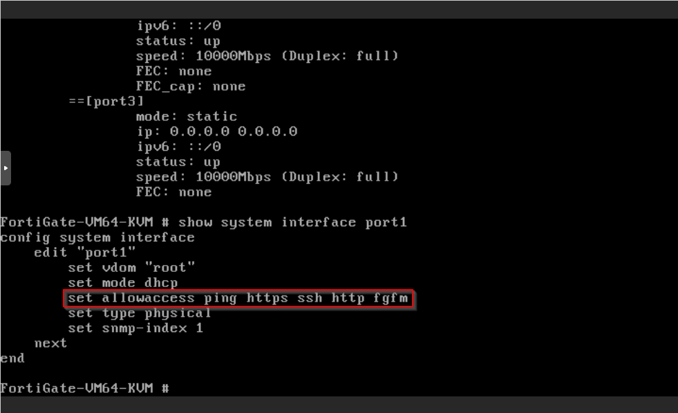

6.  Using a web browser, you can now access the FortiOS GUI interface.

    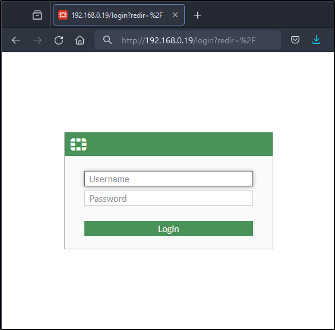
